## CinePaletteCinema
CinePaletteCinema is a movie curation app that allows users to search for movies using the TMDB API, add them to a watchlist, wishlist, or curated lists, provide reviews and ratings, and sort/search by genre, actor, or director. The app also displays top-rated movies.

## 📌 Features
Search for movies using the TMDB API

Add movies to a watchlist, wishlist, or curated lists

Provide reviews and ratings for movies

Sort and filter movies by genre, actor, or director

View top-rated movies

## 🛠 Tech Stack & Dependencies 
**Backend:**  
- Express.js - For server setup  
- Sequelize - Database ORM  
- SQLite - Lightweight database  
- Axios - For API calls  
- Jest & Supertest - For testing  
- dotenv - For managing environment variables 
- CORS - To allow cross-origin requests

### 📦 **Installed Packages**  
  axios,
  cors,
  dotenv,
  express,
  jest,
  sequelize,
  sequelize-cli,
  sqlite3,
  supertest,

  ## 🚀 How to Set Up for this project ?

  1️⃣ Clone the project Repository
``` sh
git clone https://github.com/yourusername/cinepalettecinema.git
```
cd cinepalettecinema

2️⃣ Install Dependencies
``` sh
npm install
```

3️⃣ Set Up the Database
// seed the database
```sh
npm seed
```

4️⃣ Start the Server
```sh
npm start
```
Once the server is running, the app will be available at http://localhost:3000.

### Screenshots of the projects
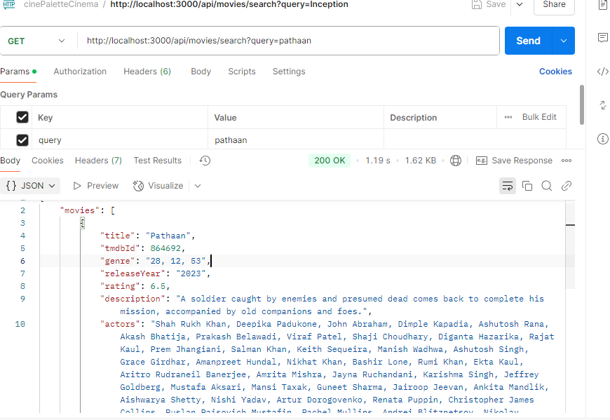
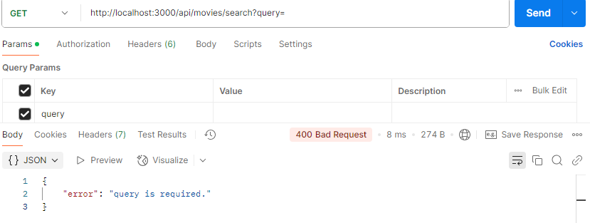
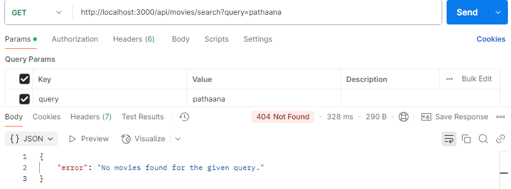
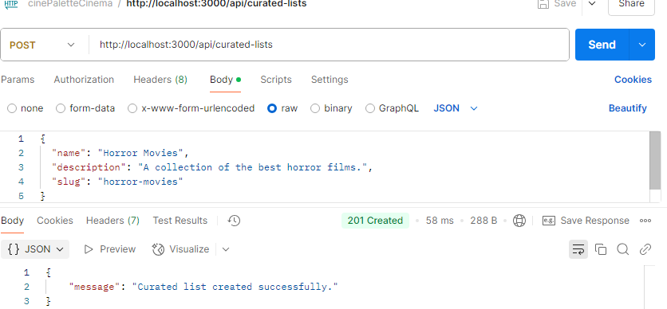
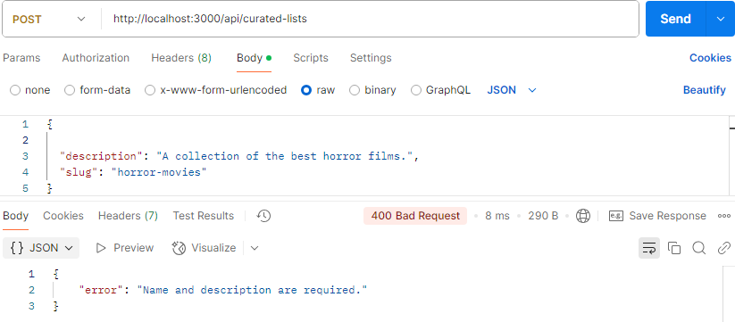
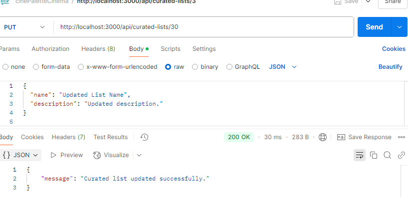
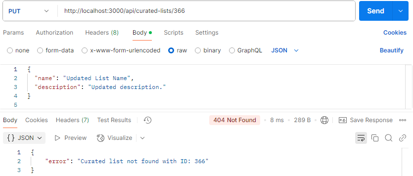
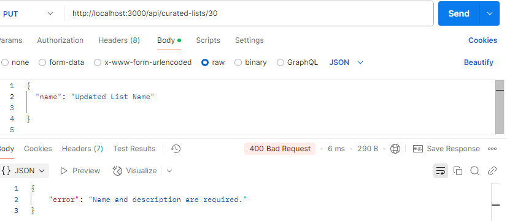
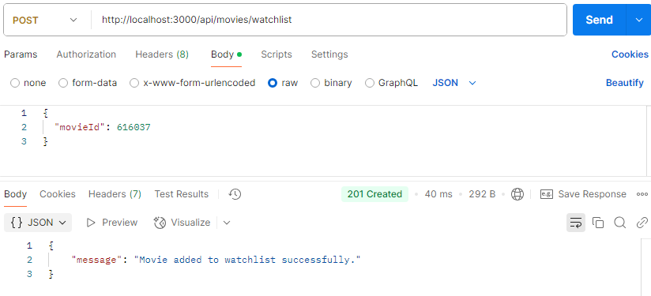

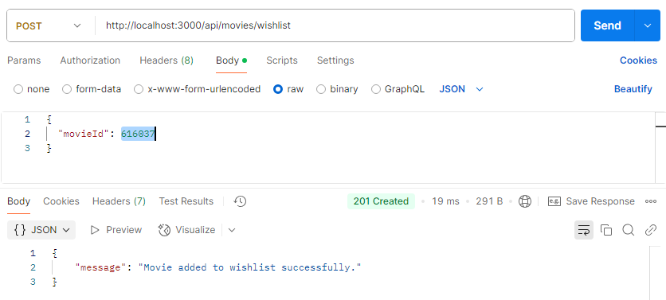
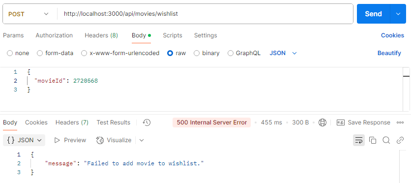

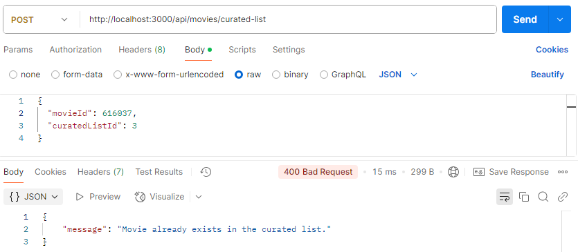
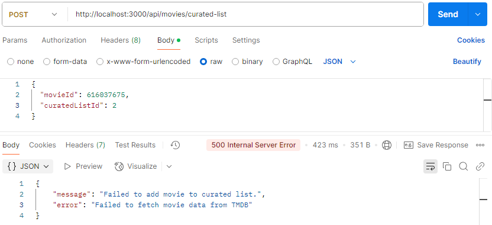
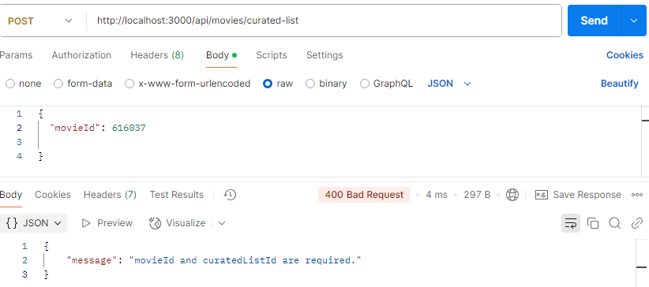

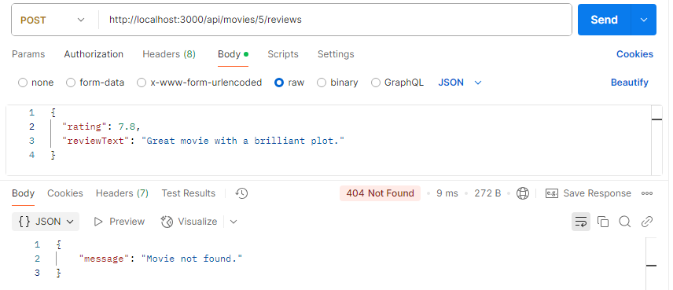
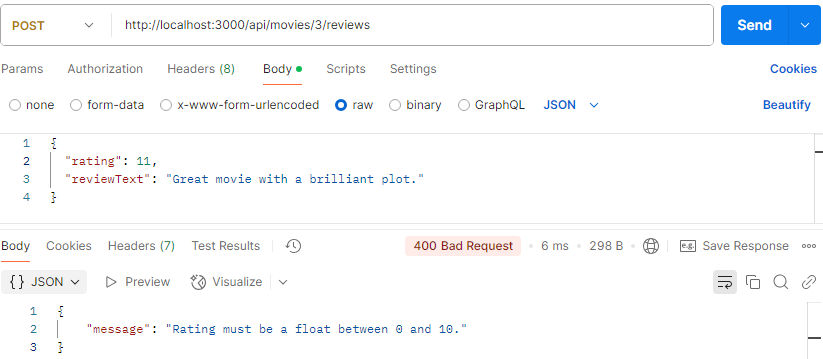
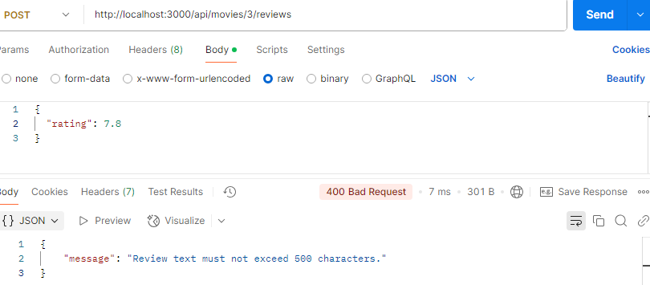
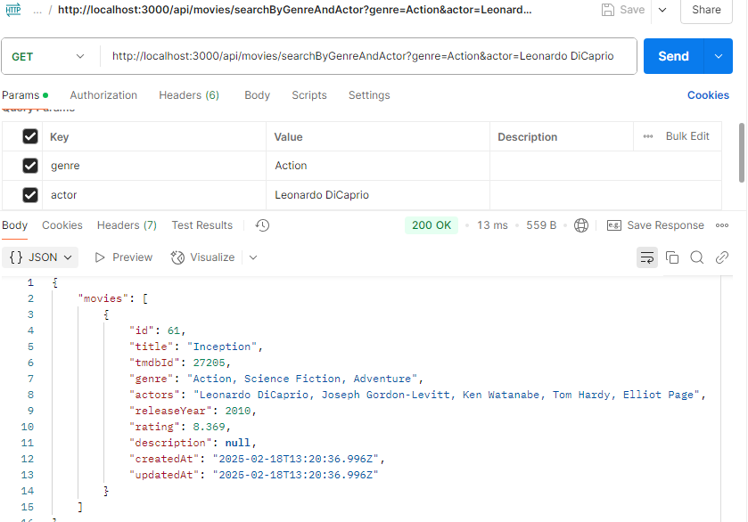

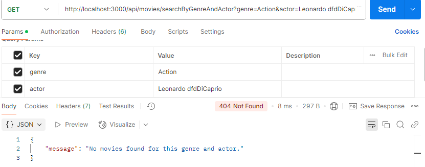
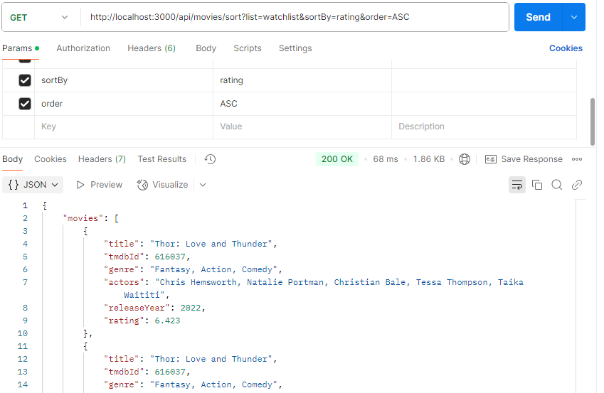

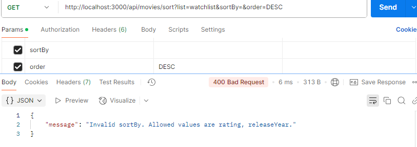
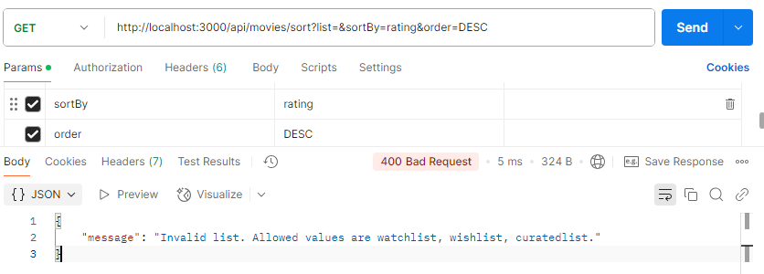
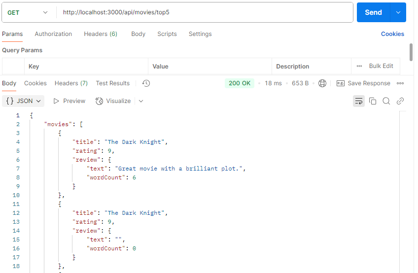
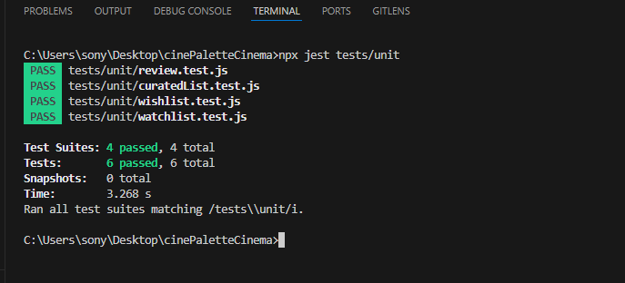

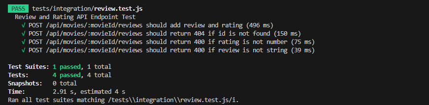

🤝 Contributing
If you want to contribute or add new features, feel free to submit a pull request! 😊

 If you like this project, don't forget to give it a ⭐! 😃

📜 License
This project is licensed under the MIT License.

